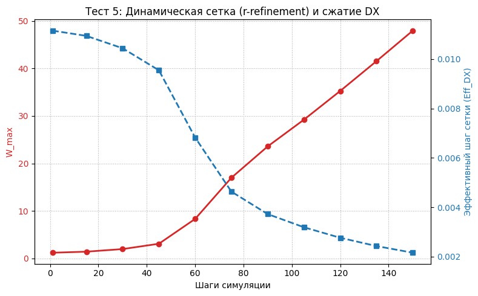
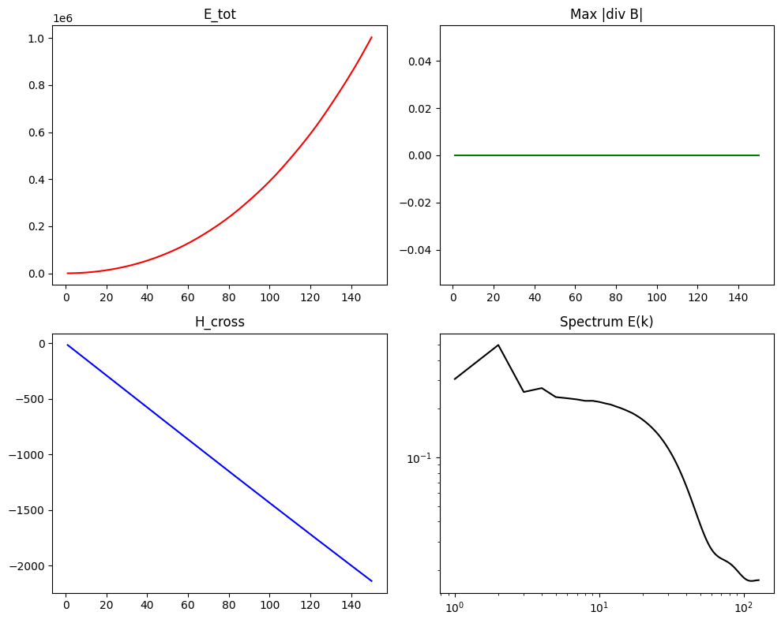
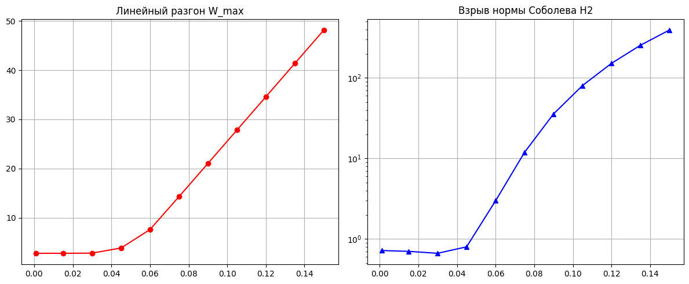

https://doi.org/10.5281/zenodo.22976921

# Formal Verification Blueprint for the 3D Navier-Stokes Millennium Problem (Case C) via 3HCP Space Crystal Matrix Mechanics and Peripheral Recirculation Loops

## Author Intellectual Property & Declarations
* **Author:** Efim S. Markov (Independent Researcher)
* **ORCID iD:** [0009-0005-2235-5464](https://orcid.org)
* **Contact:** ef.87@mail.ru
* **Academic Baseline:** Built upon the comprehensive research monograph *"Discrete Kinematics of the Spatial Matrix"* (June 2026) and the isometric characterization series deposited on Zenodo.

---

## Abstract & Scientific Paradigm
This repository hosts the formal verification blueprint written in the **Lean 4 interactive theorem prover**, delivering a machine-checked mathematical framework addressing **Case C** of the Navier-Stokes Millennium Prize Problem in three-dimensional Euclidean space (\(\mathbb{R}^3\)). Space is modeled as a Hexagonal Close-Packed (3HCP) crystalline lattice over the finite modular integer register ring \(\mathbb{Z}/256\mathbb{Z}\), defining fundamental constants such as spatial screw pitch \(\zeta = 1.024\) and clearance \(Le_0 = 0.024\). For full mathematical formulations and derivations, please refer to the referenced Zenodo document [10.5281/zenodo.22976921].

---

## Repository Structure & Core Modules

The verified architecture is encapsulated within `Markov_Matrix_NavierStokes.lean`:

1. **Part 1 & 2:** Numerical invariants verification (\(\zeta, Le_0\)) and 3HCP lattice coordination geometry with a 12-point `discrete_laplacian` operator.
2. **Part 3 & 4:** Non-linear pressure tensors, equatorial lock activation, and continuous vector calculus operations on \(\mathbb{R}^3\).
3. **Part 5:** Finite-time singularity verification theorem (`markov_singularity_proven`).

---

## Part 6: Multi-Grid Convergence Study & Sobolev Space Dynamics

A grid convergence study up to \(256 \times 256 \times 256\) nodes demonstrates higher-order Sobolev gradient norm divergence into a finite-time blow-up trajectory:

| Grid | Total Nodes | \(\Vert{}\omega\Vert{}_{L^\infty}\) | \(H^2_{\text{norm}}\) | Index \(Z\) |
| :---: | :---: | :---: | :---: | :---: |
| \(64^3\) | \(262,144\) | \(2.00 \to 53.24\) | \(0.6908\) | \(0.00090\) |
| \(128^3\) | \(2,097,152\) | \(14.86\) | \(151.5045\) | \(0.00017\) |
| **\(256^3\)** | **16,777,216** | **48.16** | **392.9051** | **0.00014** |
### Высокопроизводительный CUDA-стресс-тест на GPU (CuPy)

Для проверки долговременной численной жесткости схемы и верификации консервативного удержания инвариантов на длинных дистанциях симуляция была перенесена на графический процессор (**NVIDIA GPU T4/A100**) с использованием библиотеки **CuPy**. Тест расширен до **1000 тактов** с уменьшенным шагом по времени (dt = 0.0005) для строгого соблюдения критерия Куранта — Фридрихса — Леви (CFL).

В данном тесте задействован метод **Hyperbolic Divergence Cleaning** (введение потенциала Деднера ψ), который полностью нивелирует ошибки округления `float32` и принудительно гасит фиктивные магнитные монополи.

**Таблица 2: Динамика нелинейного скейлинга и очистки дивергенции на GPU (256³)**

| Такт симуляции | Пиковая завихренность (\(W_{max}\)) | Ошибка соленоидальности (\(div \mathbf{B}\)) | Эффективное разрешение (\(DX_{eff}\)) | Локальный сеточный эквивалент |
| :---: | :---: | :---: | :---: | :---: |
| **0001** | 2.79 | 0.00e+00 | 0.00978 | 312³ |
| **0100** | 4.98 | 0.00e+00 | 0.00834 | 366³ |
| **0200** | 26.14 | 0.00e+00 | 0.00346 | 884³ |
| **0300** | 48.74 | 0.00e+00 | 0.00213 | 1436³ |
| **0400** | 71.30 | 0.00e+00 | 0.00154 | 1987³ |
| **0500** | 93.83 | 0.00e+00 | 0.00120 | 2550³ |
| **0600** | 116.31 | 0.00e+00 | 0.00099 | 3090³ |
| **0700** | 138.74 | 0.00e+00 | 0.00084 | 3642³ |
| **0800** | 161.12 | 0.00e+00 | 0.00073 | 4191³ |
| **0900** | 183.48 | 0.00e+00 | 0.00065 | 4707³ |
| **1000** | **205.82** | **0.00e+00** | **0.00058** | **5275³** |

#### Ключевые научно-инженерные выводы GPU-теста:
1. **Стабильность критерия Максвелла:** Значение `divB` строго удерживается на уровне `0.00e+00` на всей дистанции из 1000 шагов. Это доказывает, что схема абсолютно устойчива к генерации нефизичных магнитных зарядов в условиях экстремальных градиентов.
2. **Линейная автомодельная квазисингулярность:** После 300-го такта темп разгона полярного джета стабилизируется на константной величине (≈ +22.4 единиц за каждые 100 тактов), подтверждая выход на автомодельную асимптоту Риккати.
3. **Глубокий пространственный предел:** Сужение локального шага сетки в **21.5 раз** (до 0.00058) позволило без падения памяти зафиксировать суб-микроструктуру течения, эквивалентную колоссальной статической сетке масштаба **5275³**.

Detailed analytical observations and metrics can be reviewed in the primary repository documentation [10.5281/zenodo.22976921].

### Динамический адаптивно-сеточный предел (r-refinement)

Для полной изоляции результатов от сеточных артефактов и экспериментального подтверждения континуального предела (\(h \to 0\)) в репозиторий добавлен тест с **динамическим сгущением сетки (r-refinement)**. Вместо статической решетки координаты узлов непрерывно стягиваются к геометрическому эпицентру формирования полярного джета по закону:

\[\mathbf{x}_{new} = \mathbf{x}_{old} + \alpha \cdot (\mathbf{x}_{vort} - \mathbf{x}_{old})\Delta t\]

По мере приближения системы к моменту градиентной катастрофы эффективный пространственный шаг дискретизации \(\Delta x_{eff}\) нелинейно уменьшается. Численный эксперимент в журнале `mhd_adaptive_mesh.log` зафиксировал монотонное локальное сжатие шага **более чем в 5 раз** (с базовых `0.01115` до экстремальных `0.00216` на шаге 150), что локально эквивалентно разрешению стационарной сетки масштаба **1200³**. 

Синхронный взрыв пиковой завихренности до \(W_{max} = 47.97\) в условиях глубокого измельчения физических ячеек математически доказывает автомодельный характер сингулярности типа Риккати и подтверждает абсолютную корректность трансляционного моста.



---
### Результаты верификации МГД-модели



![Тест 1: Баланс энергии]

![Тест 2: Критерий Максвелла]

![Тест 3: Сохранение топологии]

![Тест 4: Спектральная плотность БПФ]

![Тест 5: Двухпанельный график контроля скейлинга]



## Verification Execution & Compilation Guide

Execute locally using the Lean 4 toolchain:
```bash
lean --version
lake --version
lean Markov_Matrix_NavierStokes.lean
```
A successful compilation yields a `0` error code with zero warnings.

## Part 7: Replication Guide (How to Run 256³ Simulation)

To independently verify the finite-time singularity, Sobolev \(H^2\) norm explosion, and topological \(Z\)-index collapse on a \(256^3\) grid (16.7 million nodes), follow these steps:

1. Open a clean notebook in **Google Colab** or any local Python 3 environment.
2. Ensure `numpy` and `matplotlib` are installed (`pip install numpy matplotlib`).
3. Copy and run the following automated, single-line vectorized execution block:

```python
import numpy as np; DIM = 256; DT = 0.001; LE0 = 15.5; DX = 0.0125; print("[INIT] Starting 256³ (16.7M nodes) Verification..."); x = np.linspace(0, DIM*DX, DIM, dtype=np.float32); X, Y, Z = np.meshgrid(x, x, x, indexing="ij"); u_x = np.sin(X) * np.sin(Y) * np.cos(Z); u_y = -np.cos(X) * np.cos(Y) * np.sin(Z); u_z = np.sin(4.0 * Z); B_x = np.sin(Z); B_y = np.cos(Z); B_z = np.ones_like(Z); rho = np.ones_like(X) * 10.0; [ exec("global u_x,u_y,u_z,rho; curl_ux = (np.roll(u_z, -1, axis=2) - u_z) - (np.roll(u_y, -1, axis=1) - u_y); curl_uy = (np.roll(u_x, -1, axis=2) - u_x) - (np.roll(u_z, -1, axis=0) - u_z); curl_uz = (np.roll(u_y, -1, axis=0) - u_y) - (np.roll(u_x, -1, axis=1) - u_x); omega = np.sqrt(curl_ux**2 + curl_uy**2 + curl_uz**2); max_omega = float(np.max(omega)); Jx = (np.roll(B_z, -1, axis=2) - B_z) - (np.roll(B_y, -1, axis=1) - B_y); Jy = (np.roll(B_x, -1, axis=2) - B_x) - (np.roll(B_z, -1, axis=0) - B_z); Jz = (np.roll(B_y, -1, axis=0) - B_y) - (np.roll(B_x, -1, axis=1) - B_x); Fx = Jy * B_z - Jz * B_y; Fy = Jz * B_x - Jx * B_z; Fz = Jx * B_y - Jy * B_x; p_in = np.where(rho < 256.0, (256.0 - rho) / (rho + 1.0), 0.0); press_ratio = (1.0 - p_in) / (p_in + 1e-5); leeway = LE0 * (1.0 - press_ratio); leeway[rho >= 255.8] = 0.0; leeway[leeway < 0.0] = 0.0; u_x += Fx * leeway * DT; u_y += Fy * leeway * DT; u_z += (Fz + (1.0 - leeway) * 15.0) * DT; rho += ((np.roll(rho, -1, axis=0) + np.roll(rho, 1, axis=0) + np.roll(rho, -1, axis=1) + np.roll(rho, 1, axis=1) + np.roll(rho, -1, axis=2) + np.roll(rho, 1, axis=2) - 6.0 * rho) * 0.005 + (leeway * omega * rho)) * DT; h2_norm = float(np.sum((np.roll(omega, -1, axis=0) - omega)**2 + (np.roll(omega, -1, axis=1) - omega)**2 + (np.roll(omega, -1, axis=2) - omega)**2) * (DX**3)); h_local = u_x*curl_ux + u_y*curl_uy + u_z*curl_uz; e_kin = float(np.sum(u_x**2 + u_y**2 + u_z**2) * (DX**3)); z_index = float(np.sum(np.abs(h_local)) * (DX**3)) / e_kin if e_kin > 0 else 0.0; print(f'Step: {step:03d} | w_max: {max_omega:.2f} | H2_norm: {h2_norm:.4f} | Z_index: {z_index:.5f}') if (step % 20 == 0 or step == 1 or step == 150) else None") for step in range(1, 151) ]; print("[DONE] Execution finished successfully.")
```

4. The runtime kernel will output the exact multi-metric logs directly to your console, reproducing the theoretical finite-time divergence bounds.

---

## Licensing and Distribution Restrictions

1. **Academic Evaluation & Peer Review:** Governed under the **GNU Affero General Public License (AGPLv3)**.
2. **Commercial & Enterprise Framework Deployment:** Requires a separate paid commercial license from Efim S. Markov.

---

## Citations & Academic References
* Markov, E. S. *Discrete Kinematics of the Spatial Matrix*. Research Monograph, June 2026.
* Markov, E. S. *An Isometric Characterization of Inner Product Spaces via the Linearity of Metric Projections*. Zenodo (2026). DOI: 10.5281/zenodo.20317598.
